# Pharma GCC Transformation Handbook

A definitive and extensive guide to pharmaceutical Global Capability Center (GCC) transformation in the AI era.

This application is a highly comprehensive, modern web platform built with React, TypeScript, and Tailwind CSS. It is designed to serve as a centralized hub for understanding the value chain, commercial aspects, enablers, and foundations of pharmaceutical GCCs. This project provides extensive documentation and architectural insights, reflecting how GCCs streamline end-to-end enterprise transformation in the pharmaceutical sector.

## Live Application
🌍 **[Explore the Application](https://kr-pharma-guidebook-hub.lovable.app)**

---

## Table of Contents
- [Overview](#overview)
- [Key Features](#key-features)
- [Demo & Media Gallery](#demo--media-gallery)
  - [Video Walkthrough](#video-walkthrough)
  - [Animated Demo](#animated-demo)
  - [Themes](#themes)
  - [Sections](#sections)
  - [Views & Modals](#views--modals)
- [Tech Stack](#tech-stack)
- [Installation & Setup](#installation--setup)
- [Testing & Build](#testing--build)
- [License](#license)

---

## Overview

The Pharma GCC Transformation Handbook provides profound insights into the pharmaceutical industry's digital and operational transformation. It features an interactive, modern interface meticulously divided into logical sections detailing the multifaceted dimensions of the pharma ecosystem. Whether you are seeking knowledge on basic principles or evaluating deep commercial strategies, the handbook brings value through a centralized digital experience.

### Key Features

- **Interactive UI:** Fully responsive design built with a modern stack consisting of React, TypeScript, and Tailwind CSS.
- **Dynamic Themes:** First-class support for both Light and Dark modes, allowing an optimal reading and exploration experience under any condition.
- **Comprehensive Sections:**
  - **Foundations:** Basic principles, history, and foundational knowledge of Global Capability Centers.
  - **Value Chain:** Deep dive into the end-to-end pharmaceutical value chain.
  - **Commercial:** Advanced commercial strategies, market models, and operational capabilities.
  - **Enterprise Enablers:** Key technological and operational enablers driving digital transformation in modern GCCs.
- **Search Functionality:** Easily find chapters, specific resources, and deep documentation across the handbook.

---

## Demo & Media Gallery

Explore the visual capabilities of the application. The media below has been carefully generated to provide a comprehensive look at the platform's UI, themes, and robust content sections.

### Video Walkthrough

We have generated an automated video demonstrating the site navigation, featuring an embedded audio track for a complete viewing experience:

*Click the image or [here](src/assets/screenshots/site-demo-with-music.mp4) to download/view the high-quality MP4 with music.*

### Animated Demo

Here is a quick animated GIF highlighting the platform's different themes and navigating across the vital sections:

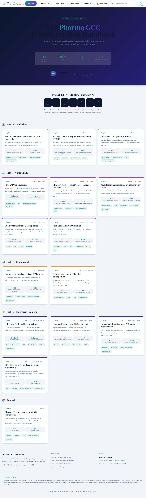

### Themes

The application supports robust, dynamic theming. Here is a comparison of the site across Light and Dark modes:

  
  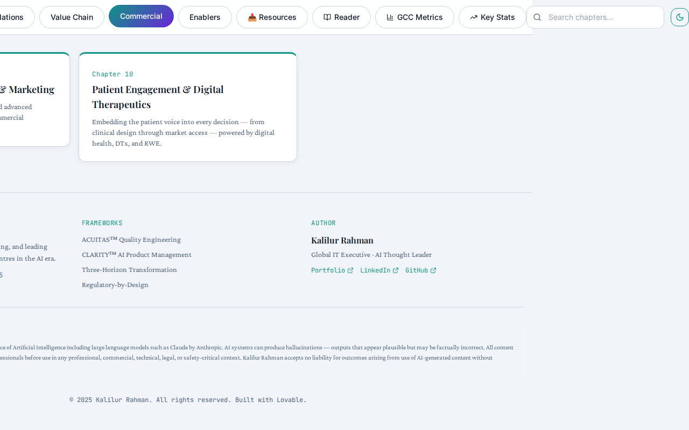

### Sections

An extensive view of the meticulously categorized sections, guiding the user through the foundations, commercial operations, value chain, and enablers:

  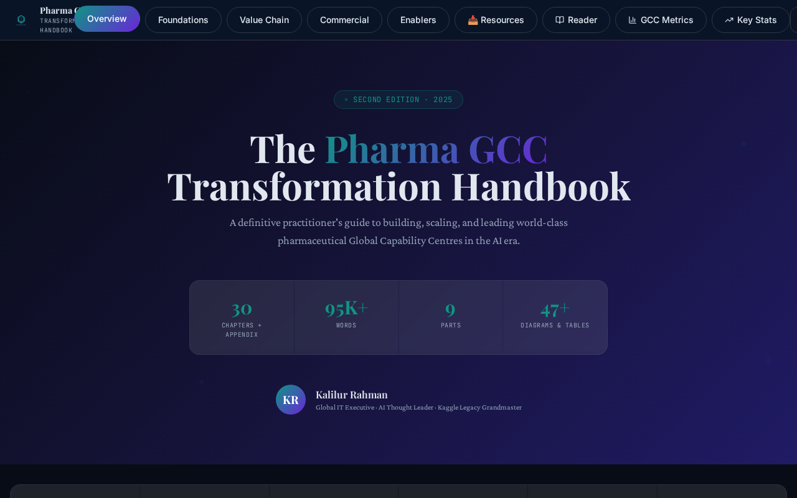
  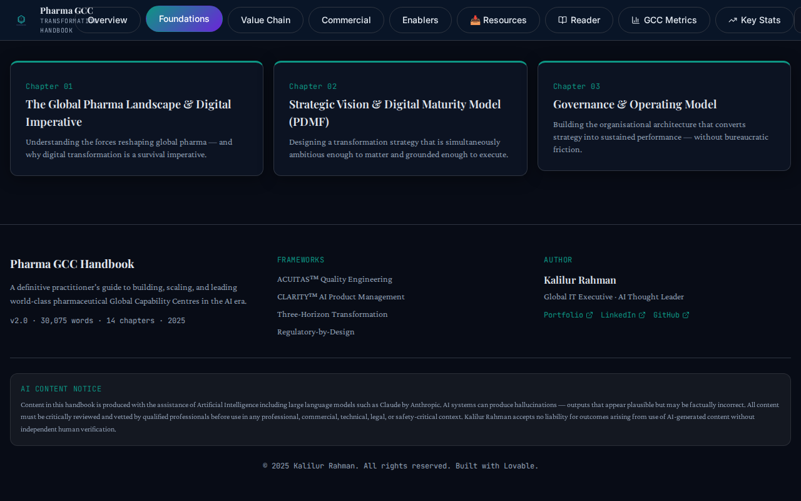
  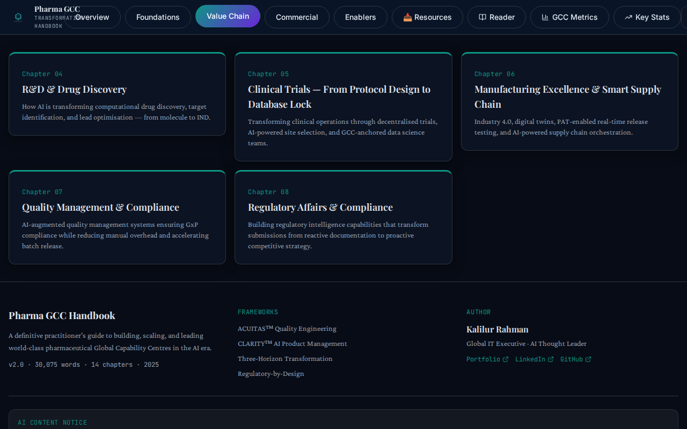
  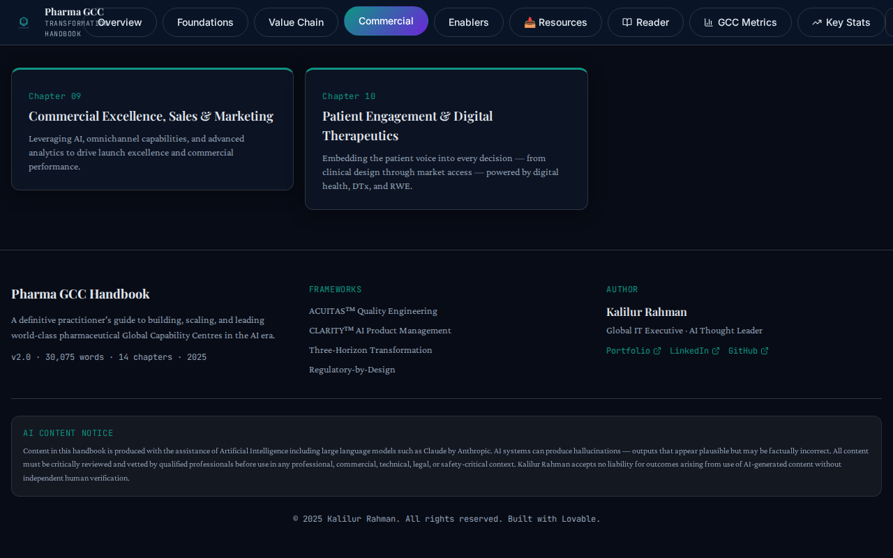
  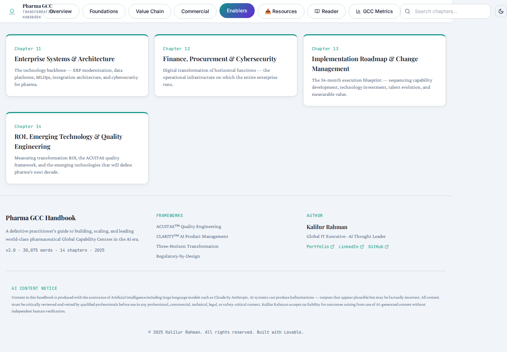
  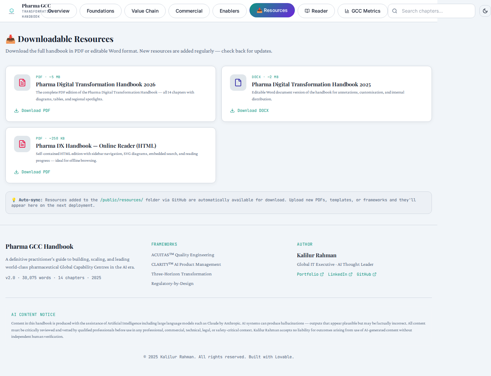

### Views & Modals

Key interactions, the dedicated online reader, metrics analysis, and specific chapter popovers:

  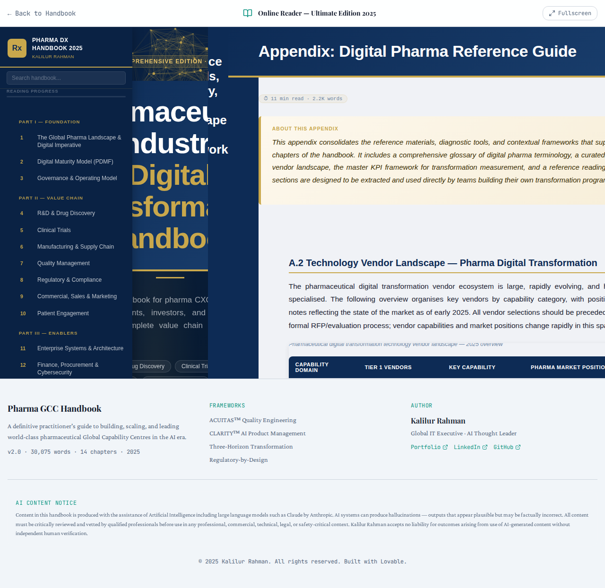
  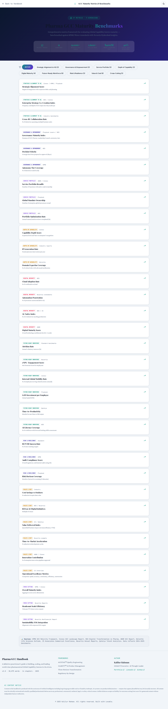
  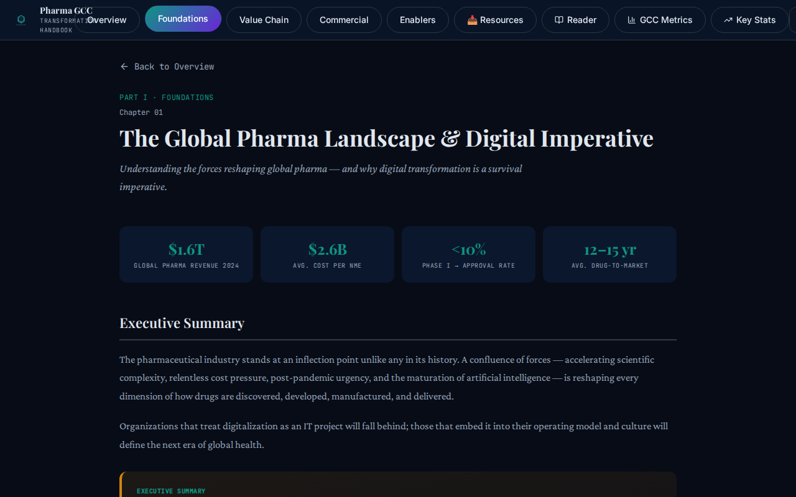

---

## Tech Stack

- **Frontend:** TypeScript, React, Tailwind CSS, HTML5
- **Icons:** Lucide React
- **Animations:** Framer Motion
- **Build Tool:** Vite
- **Testing:** Vitest

---

## Installation & Setup

1. Clone the repository:
   \`\`\`bash
   git clone https://github.com/kalilurrahman/kr-pharma-guidebook-hub.git
   \`\`\`

2. Navigate into the directory and install dependencies:
   \`\`\`bash
   cd kr-pharma-guidebook-hub
   npm install
   \`\`\`

3. Build and Preview the application locally:
   \`\`\`bash
   npm run build
   npm run preview
   \`\`\`
   *(The application will be served by default on port 4173)*

## Testing & Build

To ensure project integrity:

- **Run tests:**
  \`\`\`bash
  npm test
  \`\`\`
- **Verify Production Build:**
  \`\`\`bash
  npm run build
  \`\`\`

---

## License

MIT License
