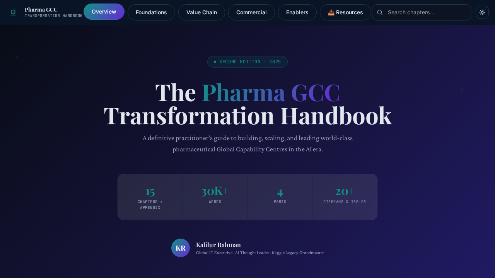
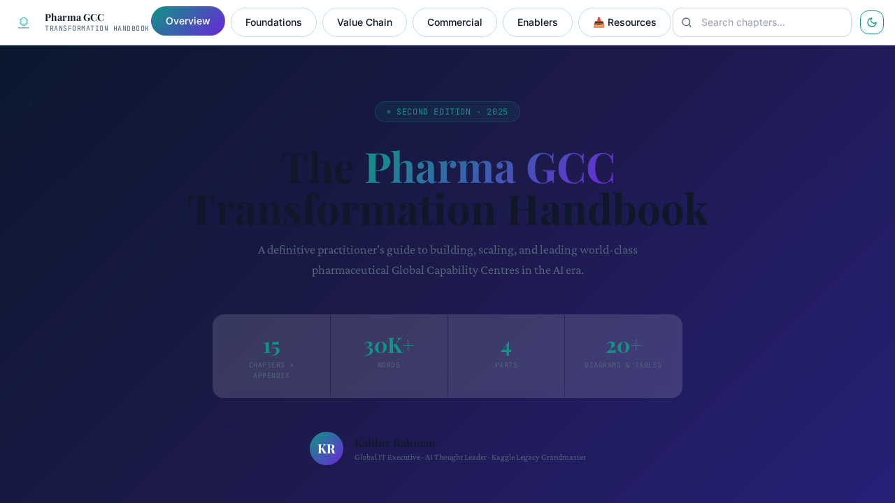
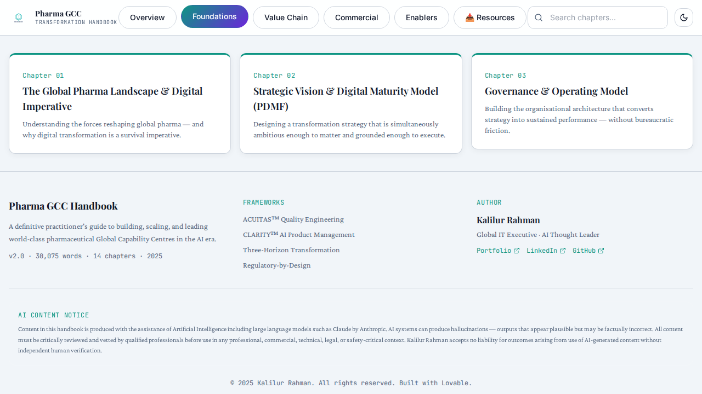
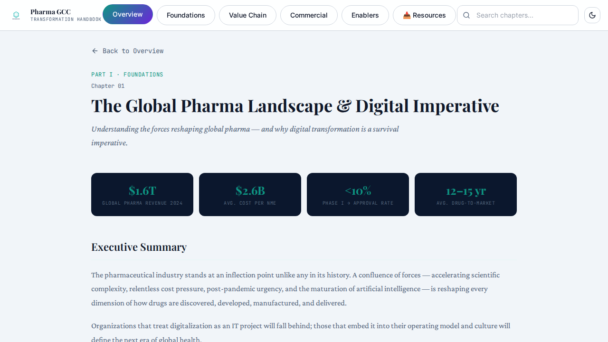
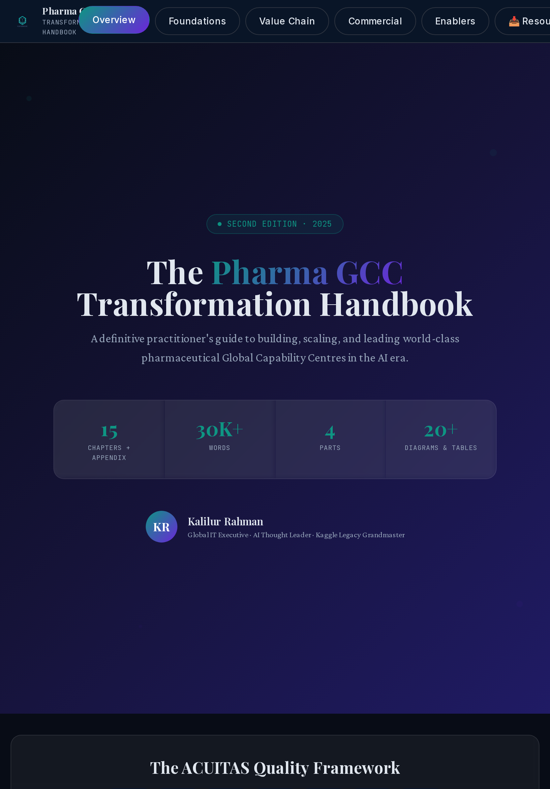
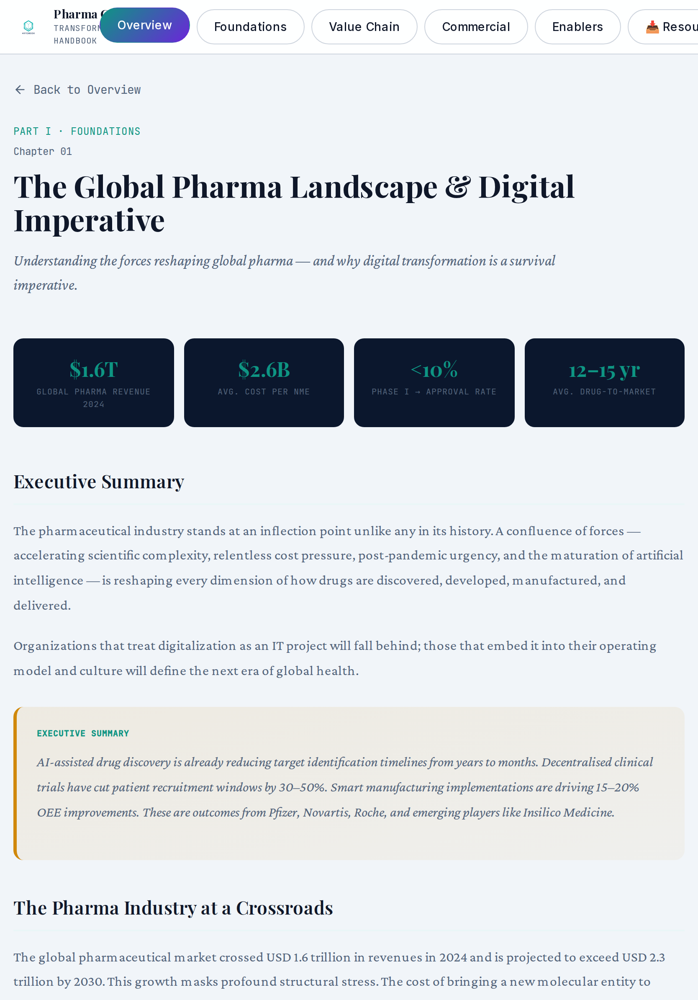
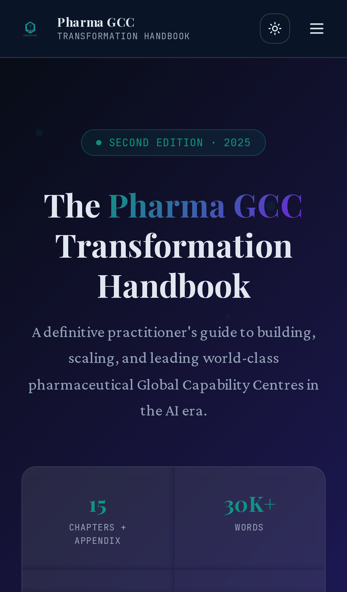
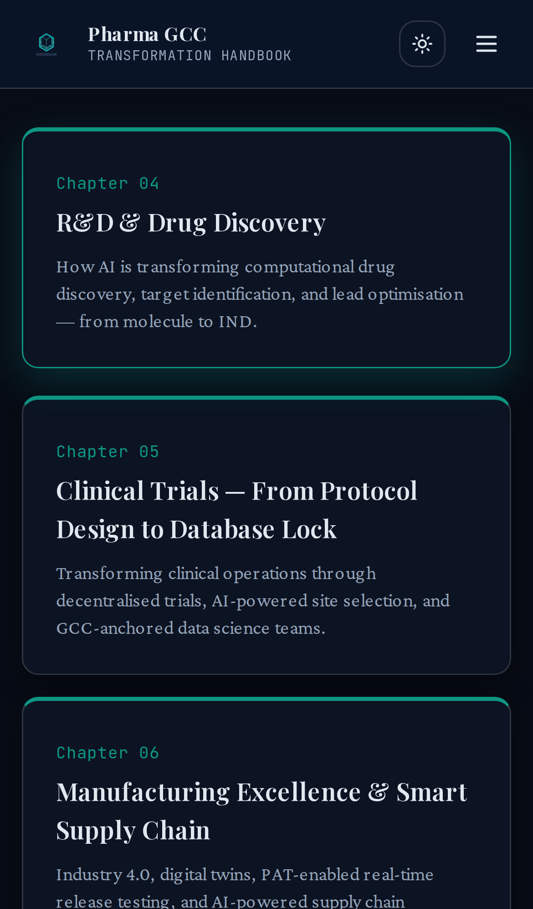

# Pharma GCC Transformation Handbook

A definitive guide to pharmaceutical Global Capability Center (GCC) transformation in the AI era.

This application is a comprehensive, modern web platform designed to serve as a centralized hub for understanding the value chain, commercial aspects, enablers, and foundations of pharmaceutical GCCs.

## Live Application
🌍 **[Explore the Application](https://kr-pharma-guidebook-hub.lovable.app)**

## Overview

The Pharma GCC Transformation Handbook provides deep insights into the pharmaceutical industry's transformation. It features an interactive, modern interface with different sections outlining the various aspects of the pharma ecosystem.

### Key Features

- **Interactive UI:** Fully responsive design built with React, TypeScript, and Tailwind CSS.
- **Dynamic Themes:** Built-in Light and Dark mode switching for optimal reading experience.
- **Comprehensive Sections:**
  - **Foundations:** Basic principles and foundational knowledge.
  - **Value Chain:** Insights into the pharmaceutical value chain.
  - **Commercial:** Commercial strategies and models.
  - **Enterprise Enablers:** Key enablers driving enterprise transformation.
- **Reader Mode:** Distraction-free reading experience for individual chapters.
- **Search Functionality:** Easily find chapters and resources.

## Demo & Screenshots

Here is an animated demo of the site highlighting different themes and sections:

You can also view a high-quality video demo [here](./src/assets/screenshots/site-demo.mp4).

Here is a visual summary of the application across different themes, sections, and devices:

### Desktop View
- **Light Theme (Overview)**
  
- **Dark Theme (Overview)**
  
- **Foundations Section**
  
- **Reader Mode**
  

### Tablet View
- **Light Theme (Overview)**
  
- **Reader Mode**
  

### Mobile View
- **Light Theme (Overview)**
  
- **Value Chain Section**
  

## Tech Stack

- **Frontend:** TypeScript, React, Tailwind CSS, HTML5
- **Icons:** Lucide React
- **Animations:** Framer Motion
- **Build Tool:** Vite

## Installation & Setup

1. Clone the repository:
   \`\`\`bash
   git clone https://github.com/kalilurrahman/kr-pharma-guidebook-hub.git
   \`\`\`

2. Install dependencies:
   \`\`\`bash
   npm install
   \`\`\`

3. Build and Preview the application:
   \`\`\`bash
   npm run build && npm run preview
   \`\`\`

## License
MIT License
