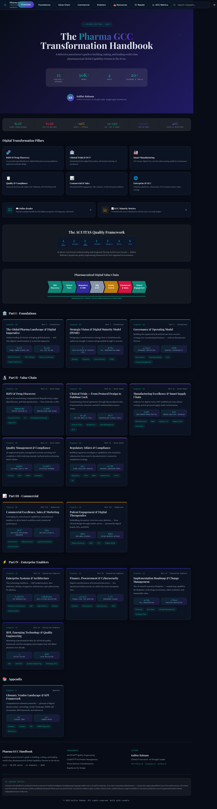
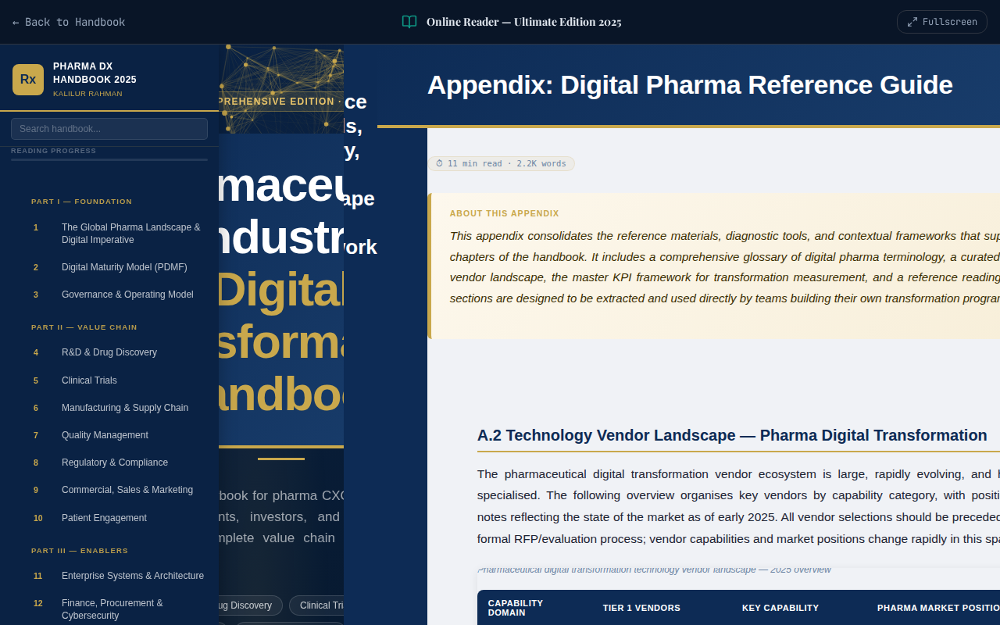
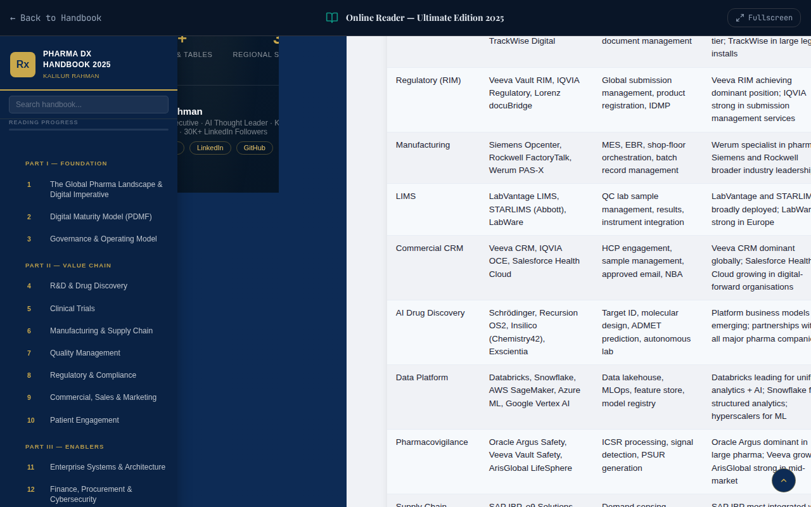
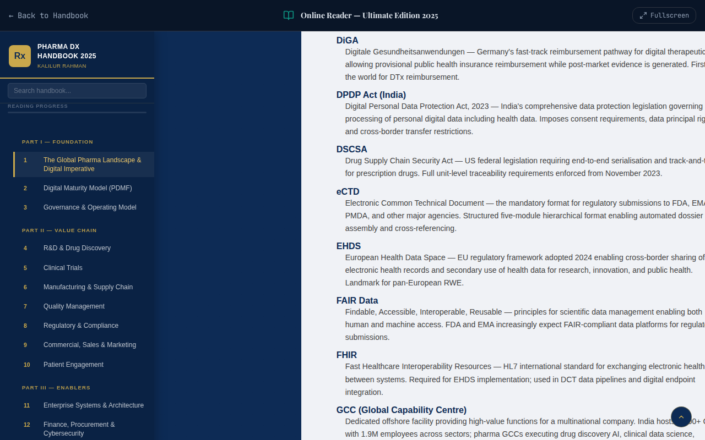
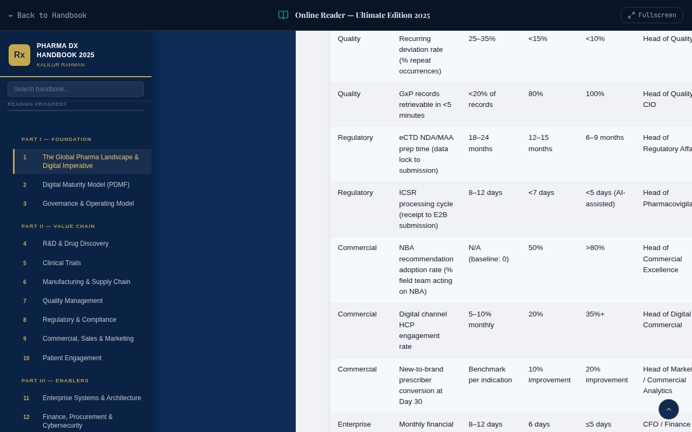
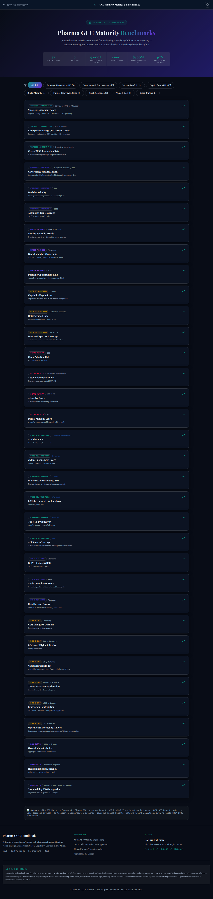
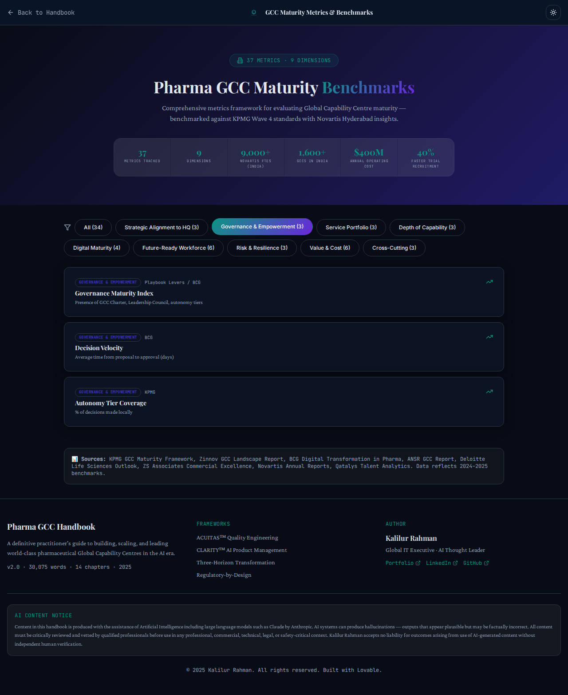
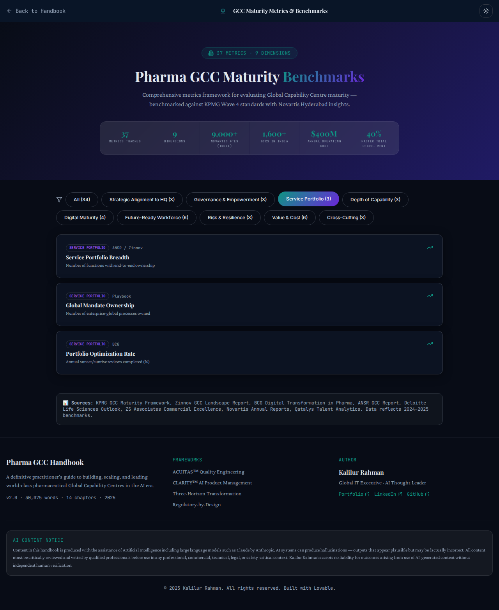

# Pharma GCC Transformation Handbook

A definitive guide to pharmaceutical Global Capability Center (GCC) transformation in the AI era.

This application is a comprehensive, modern web platform designed to serve as a centralized hub for understanding the value chain, commercial aspects, enablers, and foundations of pharmaceutical GCCs.

## Live Application
🌍 **[Explore the Application](https://kr-pharma-guidebook-hub.lovable.app)**

---

## Table of Contents
- [Overview](#overview)
- [Key Features](#key-features)
- [Demo & Screenshots](#demo--screenshots)
  - [Themes](#themes)
  - [Sections](#sections)
  - [Online Reader](#online-reader)
  - [GCC Metrics](#gcc-metrics)
  - [Views & Modals](#views--modals)
- [Tech Stack](#tech-stack)
- [Installation & Setup](#installation--setup)
- [License](#license)

## Overview

The Pharma GCC Transformation Handbook provides deep insights into the pharmaceutical industry's transformation. It features an interactive, modern interface with different sections outlining the various aspects of the pharma ecosystem.

### Key Features

- **Interactive UI:** Fully responsive design built with React, TypeScript, and Tailwind CSS.
- **Dynamic Themes:** Built-in Light and Dark mode switching for optimal reading experience.
- **Comprehensive Sections:**
  - **Foundations:** Basic principles and foundational knowledge.
  - **Value Chain:** Insights into the pharmaceutical value chain.
  - **Commercial:** Commercial strategies and models.
  - **Enterprise Enablers:** Key enablers driving enterprise transformation.
- **Search Functionality:** Easily find chapters and resources.

## Demo & Screenshots

Here is an animated demo of the site highlighting different themes and sections:

Here is a comprehensive visual summary of the application across different themes, sections, and views:

### Themes

The main portfolio site supports dynamic themes. Here is how it looks across different modes:

  
  

### Sections

Detailed sections showcasing foundations, value chain, commercial aspects, enablers, and resources.

  
  
  
  
  
  

### Online Reader

The Online Reader provides a seamless, distraction-free environment for consuming the Pharma GCC Transformation Handbook content. It supports fullscreen mode and dynamic chapter navigation.

  
  
  
  

### GCC Metrics

The GCC Metrics dashboard provides comprehensive benchmarking data, maturity models, and key performance indicators essential for evaluating and scaling pharmaceutical Global Capability Centers.

  
  
  

### Views & Modals

Additional views including isolated chapter modals showcasing specific metrics, insights, and diagram integrations.

  
  
  

## Tech Stack

- **Frontend:** TypeScript, React, Tailwind CSS, HTML5
- **Icons:** Lucide React
- **Animations:** Framer Motion
- **Build Tool:** Vite

## Installation & Setup

1. Clone the repository:
   \`\`\`bash
   git clone https://github.com/kalilurrahman/kr-pharma-guidebook-hub.git
   \`\`\`

2. Install dependencies:
   \`\`\`bash
   npm install
   \`\`\`

3. Build and Preview the application:
   \`\`\`bash
   npm run build && npm run preview
   \`\`\`

## License
MIT License
